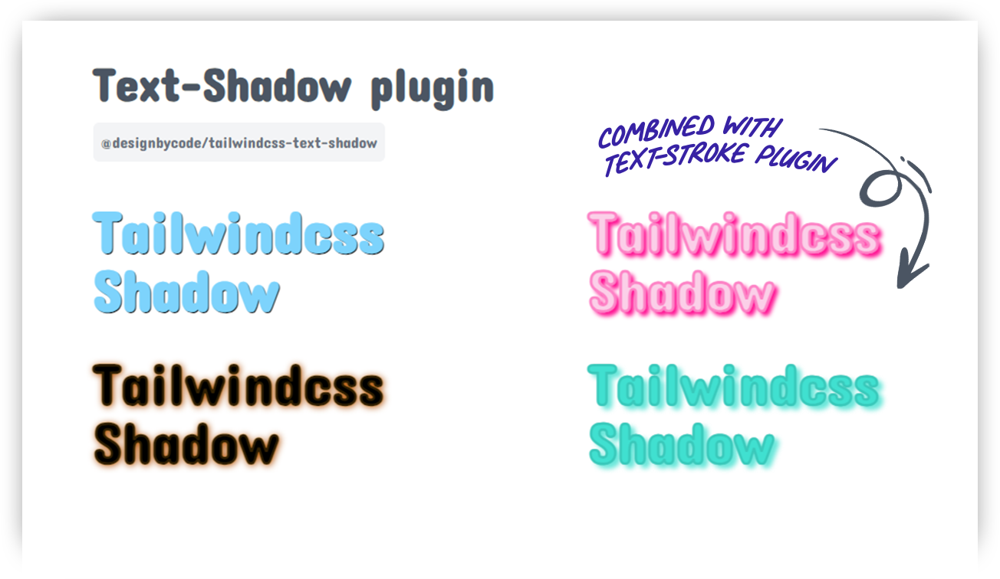
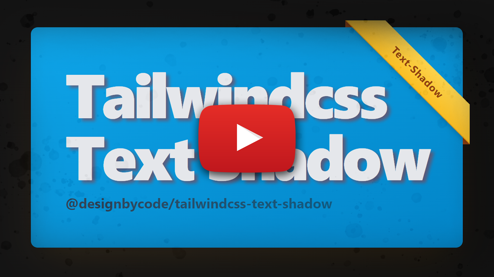

<a href="#installation" width="100%">

</a>

## Tailwind CSS Text Shadow Plugin

[](https://badge.fury.io/js/@designbycode%2Ftailwindcss-text-shadow)


[](https://github.com/DesignByCode/tailwindcss-text-shadow/stargazers)
[](http://hits.dwyl.com/designbycode/tailwindcss-text-shadow)

[](https://nodei.co/npm/@designbycode/tailwindcss-text-shadow/)

The Tailwind CSS **Text Shadow Plugin** extends the default set of utility classes in **Tailwind CSS** to provide easy text shadow customization for your web projects. With this plugin, you can apply custom text shadows using utility
classes or define your own text shadow variations based on predefined steps and color palettes.



## 📇 Table of Contents

* [Tailwind CSS Text Shadow Plugin](#tailwind-css-text-shadow-plugin)
    * [Installation](#installation)
        * [Using pnpm](#using-pnpm)
        * [Using npm](#using-npm)
        * [Using yarn](#using-yarn)
        * [Setup](#setup)
        * [Default configuration styles](#default-configuration-styles)
    * [Use](#use)
        * [Video Tutorial](#video-tutorial)
        * [Apply Text Shadows](#apply-text-shadows)
        * [Text shadow blur modifier](#text-shadow-blur-modifier)
        * [Text shadow x and y modifiers](#text-shadow-x-and-y-modifiers)
        * [Text shadow color modifier](#text-shadow-color-modifier)
        * [Text shadow color opacity](#text-shadow-color-opacity)
    * [Customization](#customization)
        * [Example](#example)
    * [License](#license)
    * [Author](#author)
    * [Acknowledgments](#acknowledgments)

## Installation

To use this plugin, you need to have Tailwind CSS installed in your project. If you haven't installed Tailwind CSS yet, follow these steps:

#### Using pnpm

```bash
pnpm add @designbycode/tailwindcss-text-shadow
```

#### Using npm

```bash
npm install @designbycode/tailwindcss-text-shadow
```

#### Using yarn

```bash
yarn add @designbycode/tailwindcss-text-shadow
```

### Setup

1. Add the Plugin to your Tailwind CSS Config
   In your tailwind.config.js file, add the plugin to the plugins array:

```javascript
module.exports = {
    // ...other configurations
    plugins: [
        // ...other plugins
        require("@designbycode/tailwindcss-text-shadow"),
    ],
};
```

### Default configuration styles

2. If the default styles do not suit your preferences, you can effortlessly customize them using the following configuration options

```javascript
module.exports = {
    // ...other configurations
    require("@designbycode/tailwindcss-text-shadow"
)
({
    shadowColor: "rgba(0, 0, 0, 0.5)",
    shadowBlur: "3px",
    shadowOffsetX: "2px",
    shadowOffsetY: "2px",
})
```

## Use

### Video Tutorial

See plugin in action in video below. 👇

[](https://youtu.be/Xb0wAMAGAHE)

### Apply Text Shadows

Once the plugin is added to your Tailwind CSS configuration, you can use the provided utility classes to apply text shadows to your HTML elements.

```html
<h1 class="text-4xl text-shadow ">
    Hello, Tailwind CSS!
</h1>
```

### Text shadow blur modifier

To make the spread or blur bigger add the ```.text-shadow-blur-{value}```

```html
<h1 class="text-4xl text-shadow text-shadow-blur-2 ">
    Hello, Tailwind CSS!
</h1>
```

### Text shadow x and y modifiers

The shadow can be moved on the xy axis using ```.text-shadow-x-{value}``` and ```.text-shadow-y-{value}```

```html
<h1 class="text-4xl text-shadow text-shadow-x-md text-shadow-y-lg text-shadow-blur-2 text-shadow-red">
    Hello, Tailwind CSS!
</h1>
```

### Text shadow color modifier

```html
<h1 class="text-4xl text-shadow text-shadow-x-md text-shadow-y-lg text-shadow-blur-2 text-shadow-red-500">
    Hello, Tailwind CSS!
</h1>
```

In the example above, the ```<h1>``` element will have a red text shadow with an x offset of 3px, a y offset of 4px, and a blur radius of 2px. The text-shadow class enables the text shadow styles, while the text-shadow-x-md,
text-shadow-y-lg, and
text-shadow-blur-2 classes customize the horizontal offset, vertical offset, and blur radius, respectively.

### Text shadow color opacity

To change the opacity of the text-shadow-color use the following method

```html
<h1 class="text-shadow text-shadow-red-500/10">
    Hello, Tailwind CSS!
</h1>

<!-- with  arbitrary values -->

<h1 class="text-shadow text-shadow-red-[rgb(0,0,0,0.5)]">
    Hello, Tailwind CSS!
</h1>

<!-- or arbitrary with / -->

<h1 class="text-shadow text-shadow-red-[gray]/20">
    Hello, Tailwind CSS!
</h1>
```

## Customization

You can customize the available text shadow options by modifying the theme.textShadowSteps property in your tailwind.config.js file. The steps defined in this object will be used to generate utility classes for each aspect of the text
shadow.

### Example

```javascript
// tailwind.config.js
module.exports = {
    theme: {
        textShadowSteps: {
            sm: "1px",
            md: "2px",
            lg: "3px",
            xl: "4px",
            0: "0",
            1: "1px",
            2: "2px",
            3: "3px",
            4: "4px",
        },
    },
};
```

In this example, we have customized the textShadowSteps object with only four steps for sm, md, lg, and xl, and removed the rest. The plugin will generate utility classes accordingly.

> **Warning**
> New experimental long shadow feature

```javascript
module.exports = {
    // ...other configurations
    require("@designbycode/tailwindcss-text-shadow"
)
({
    experimental: true,
    shadowColor: "rgba(0, 0, 0, 0.5)",
    shadowBlur: "3px",
    shadowOffsetX: "2px",
    shadowOffsetY: "2px",
})
```

## Contributing

Contributions to this plugin are welcome! If you encounter any issues, have feature requests, or want to improve the plugin, feel free to create a pull request or submit an issue on the GitHub repository.

## License

This project is licensed under the [MIT](LICENCE) License - see the [LICENSE](LICENCE) file for details.

## Author

<div>

</div>
<h2 style="margin-top:0">Claude Myburgh</h2><ul style="padding-left:0;margin-top:-.63rem;list-style:none"><li>Github:<a href="https://github.com/designbycode"> @designbycode</a></li><li>Npm:<a href="https://www.npmjs.
com/~designbycode_"> @designbycode_</a></li></ul>

## Acknowledgments

- This plugin is inspired by the needs of web developers using Tailwind CSS.
- Special thanks to the Tailwind CSS team for creating such an amazing framework.

